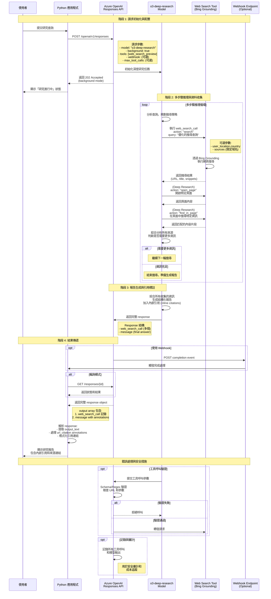

# O3-Deep-Research with Web Search - Sequence Diagram

本文檔展示使用者呼叫 o3-deep-research 模型並啟用 web search 功能後的完整互動流程。

## 系統架構說明

O3-Deep-Research 是一個進階研究模型，能夠：
- 執行多步驟推理 (multi-step reasoning)
- 進行網頁搜尋 (web search)
- 瀏覽和分析數百個來源
- 生成具有引用的綜合報告

當啟用 Web Search 時，模型會透過 Grounding with Bing Search 取得即時資訊並提供內嵌引用。

## 完整互動流程圖



## Response 結構詳解

### 1. Web Search Call 記錄

```json
{
    "id": "ws_xxx",
    "type": "web_search_call",
    "status": "completed",
    "action": {
        "type": "search",
        "query": "優化後的搜尋查詢",
        "sources": ["domain1.com", "domain2.com"]
    }
}
```

**Action Types:**
- `search`: 執行網頁搜尋（會產生費用）
- `open_page`: (Deep Research) 開啟特定頁面
- `find_in_page`: (Deep Research) 在頁面中搜尋

### 2. Final Message with Citations

```json
{
    "id": "msg_xxx",
    "type": "message",
    "status": "completed",
    "role": "assistant",
    "content": [
        {
            "type": "output_text",
            "text": "研究結果內容...",
            "annotations": [
                {
                    "type": "url_citation",
                    "start_index": 100,
                    "end_index": 250,
                    "url": "https://example.com/article",
                    "title": "文章標題"
                }
            ]
        }
    ]
}
```

## 最佳實踐

### 1. 執行模式
- ✅ **使用 `background: true`** 避免超時
- ✅ **配置 webhook** 接收完成通知
- ✅ **增加 timeout 設定**（若不使用 background mode）

### 2. 成本與延遲控制
- 使用 `max_tool_calls` 限制工具呼叫次數
- 每次 `search` action 會產生 Bing Grounding 費用
- `open_page` 和 `find_in_page` 不產生額外搜尋費用

### 3. 安全措施
- 記錄並審查所有工具呼叫
- 使用 schema 或 regex 驗證工具參數
- 在開啟或分享前驗證連結

### 5. 地理位置控制
```json
{
    "tools": [{
        "type": "web_search_preview",
        "user_location": {
            "type": "approximate",
            "country": "TW"  // ISO 3166-1 country code
        }
    }]
}
```

## 使用場景

### 適合使用 O3-Deep-Research 的情境：
- 📚 法律或科學研究
- 📊 市場與競爭分析
- 📈 基於大量內部或公開資料的報告
- 🔍 需要綜合數百個來源的深度調查
- 📝 需要完整引用的學術或商業報告

### 執行時間考量：
- **Quick Web Search**: 秒級回應
- **Agentic Search**: 分鐘級（適合複雜工作流程）
- **Deep Research**: 數分鐘（適合背景執行的完整調查）

## 技術規格

### 支援的模型
- Web Search (無推理): `gpt-4.1`, `gpt-5` 等
- Agentic Search: 推理模型（reasoning models）
- Deep Research: `o3-deep-research`

### API 端點
- **Base URL**: `https://{resource-name}.openai.azure.com/openai/v1/`
- **Endpoint**: `/responses`
- **Method**: POST

### 認證方式
- Entra ID (Azure AD): `Authorization: Bearer $TOKEN`
- API Key: `api-key: $KEY`

### 費用說明
- 每次 **search** action 產生 Bing Grounding 費用
- 參考 [Grounding with Bing 價格](https://www.microsoft.com/bing/apis/grounding-pricing)
- 模型使用費用依據 Azure OpenAI 標準定價

## 管理功能

Azure 管理員可在訂用帳戶層級管理 Web Search 功能：

### 停用 Web Search
```bash
az feature register --name OpenAI.BlockedTools.web_search \
  --namespace Microsoft.CognitiveServices \
  --subscription "<subscription-id>"
```

### 啟用 Web Search
```bash
az feature unregister --name OpenAI.BlockedTools.web_search \
  --namespace Microsoft.CognitiveServices \
  --subscription "<subscription-id>"
```

## 資料隱私與合規性

⚠️ **重要提醒：**
- 傳送至 Grounding with Bing Search 的資料會流出客戶的合規性和地理邊界
- Microsoft 資料保護增補條款 (DPA) **不適用**於 Bing Search 的資料
- 服務受 [Grounding with Bing 使用條款](https://www.microsoft.com/bing/apis/grounding-legal-enterprise) 與 [Microsoft 隱私權聲明](https://go.microsoft.com/fwlink/?LinkId=521839) 管轄

---

## 參考資源

- [Deep Research 官方文件](https://learn.microsoft.com/azure/ai-foundry/openai/how-to/deep-research)
- [Web Search 官方文件](https://learn.microsoft.com/azure/ai-foundry/openai/how-to/web-search)
- [Grounding with Bing 價格](https://www.microsoft.com/bing/apis/grounding-pricing)
- [Azure OpenAI Responses API](https://learn.microsoft.com/azure/ai-services/openai/reference)
